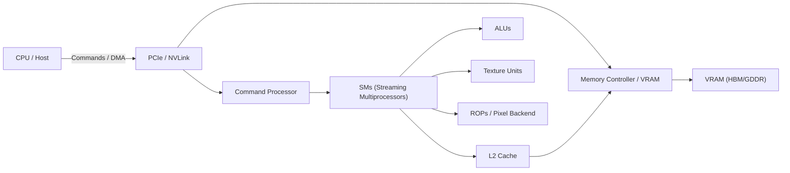
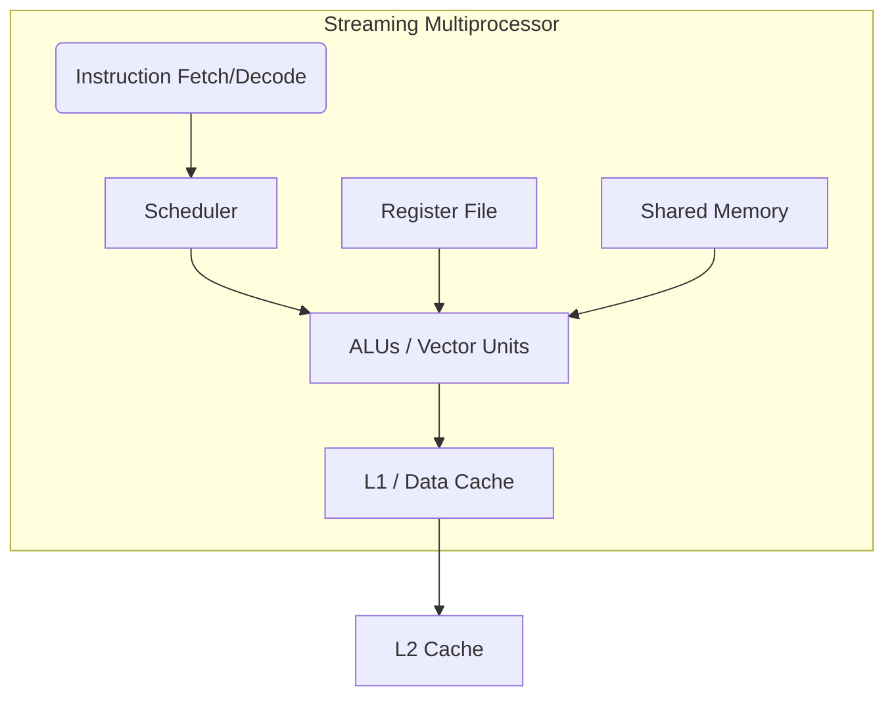

# Architecture Summary

## Objective

Summarize key GPU architecture concepts from `Research/` and `Research/gpu-architecture/` into a concise reference for the FPGA prototype and experiment planning.

## Key Components

- Streaming Multiprocessor (SM): programmable compute block containing ALUs, register files, shared memory, and schedulers.
- ALUs / Vector Units: integer and FP arithmetic units that perform the bulk compute work.
- Register File: per-thread fast storage; register pressure affects occupancy and spills.
- Shared Memory / Scratchpad (L1-like): low-latency on-chip memory for intra-block communication and reuse.
- L1 / L2 Caches: small per-SM caches (L1) and larger unified caches (L2) to reduce DRAM traffic.
- Memory Controller & VRAM (HBM/GDDR): high-bandwidth off-chip memory; bandwidth-limited workloads need careful mapping.
- Scheduler / Warp Dispatcher: issues warps/wavefronts to execution units and hides latency by switching among ready warps.

## Execution Model & Parallelism

- SIMT/SIMD-style execution: groups of lanes (warps/wavefronts) execute the same instruction in lockstep.
- Warp divergence serializes execution when threads in a warp take different control-flow paths.
- Hardware hides latency via high concurrency (many resident warps) and fast context switching among warps.

## Memory Hierarchy & Performance

- Registers: fastest per-thread storage; spills to local/global memory are costly.
- Shared memory: banked; avoid bank conflicts for best throughput.
- Global memory: highest capacity, highest latency; coalesced, aligned accesses reduce transactions and improve throughput.
- Memory bandwidth and cache behavior are primary performance drivers in data-parallel workloads.

## Design Goals (project-specific)

- Prototype target: single SM design to validate functional datapath and scheduler.
- Warp size: 8 lanes (configurable); resident warps: 2–4 for latency hiding.
- Datapath: 32-bit integer ALU baseline (optional multi-cycle FP units later).
- Memory budget example: small on-chip memory (8–16 KB shared), register file and instruction memory sized to fit prototype constraints.
- Control: simple round-robin warp scheduler; in-order pipeline (3–5 stages) is a practical baseline.

## Diagrams

### High-level GPU block diagram

### Streaming Multiprocessor (SM) internal view

### Source comparison

| Source | Typical warp | Focus / tone | Memory emphasis | Best use |
|---|---:|---|---|---|
| ENCCS (course) | 32 | Academic, detailed SM + diagrams | Detailed memory hierarchy, banking | Fundamentals, SM internals |
| Scale Computing | varies / unspecified | Vendor-oriented overview | Practical bandwidth/cache considerations | Practical mapping, bandwidth estimates |
| GPU Demystified | 32 | Introductory primer | High-level discussion of coalescing and registers | Quick primer for CUDA/SIMT concepts |

### Diagrams (local)

- [SM overview](../Diagrams/SM_overview.md)
- [Memory hierarchy notes](../Diagrams/memory_hierarchy.md)

## FPGA Mapping Implications

- Map shared memory to block RAM / BRAMs and tune sizes for resource availability.
- Implement lane datapaths as replicated RTL instances; use a warp scheduler module to broadcast instructions.
- Use small, cycle-accurate L1 models in testbench to model memory latency and contention.
- Prioritize simple, testable designs first (combinational ALU or 1-stage pipeline) then iterate toward pipelined units.

## Next Steps

- Implement and verify `lane_datapath.sv` and `lane_alu.sv` under `HDL/int_core/`.
- Create a warp scheduler testbench that exercises divergence and memory contention scenarios.
- Add annotated diagrams to `Diagrams/` (exported from trusted sources) and create a comparison table in `Overview/architecture-summary.md` contrasting sources (ENCCS, Scale Computing, GPU Demystified).

## References

- See `Research/References.md` for collected sources and reading links
