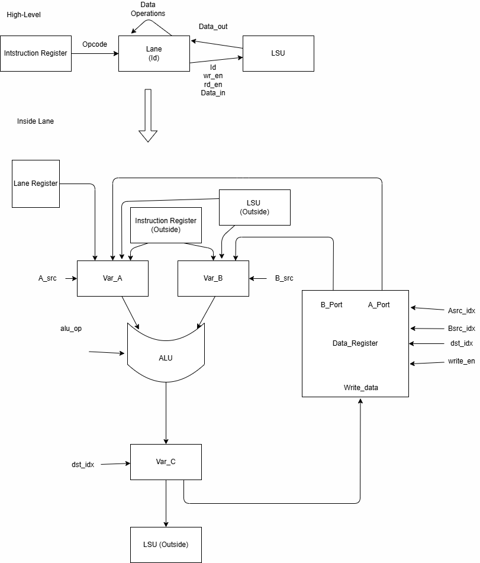

# Int_Core Notes

## Overview

This document is a place where I right down my progress and ideas as I proceed with the project.

## Notes + Log

- **6/11/26:** Created a simple lane that stores data and sends it through an ALU, as well as a warp to test 8 lanes simultaneously
  - TODOs: I need the 8 lanes to communicate with the same cache and output to said cache
  - Ideas:
    - [ ] Create a memory block that can read from two entry points (A, B), and write to one (C)
    - [ ] Create one bigger block of memory that all lanes can read from

- **6/20/26:** Currently have a late-night stream of conciusness, and realized I should write these thoughts and ideas down before I forget them:

  - The current datapath design I have is a very simplified design of what a true datapath looks like
    - The datapath should have an ISA and be able to follow instructions using a PC
    - The current design is a fancy adder, not a GPU running a process
    - Think back to 240 comp arch, the datapath should run *LD* and *LW* beyond the simple math functions
    - Instead of starting over, try expanding each section bit by bit
      - I.e: I have the basic functionality of the ALU set up, it takes 2 ints and returns one. Now try to get this integer to route to a register or memory
    - Focus on making one lane before I try implementing a multithreaded warp. Do not try to do both of them at the same time, will get complicated fast

  - *Memory Heirarchy*:
    - This is probably the most complicated aspect of the entire project. There's a lot of memory within a GPU, some shared, a lot individual
    - L1 cache is unique to each SM, while L2 is shared within the entire GPU. Bc having 1 SM would nullify the reason to have an L2 Cache, instead I could target implementing multiple SMs
      - Remember: GPU -> SM -> Datapath
    - Each path should also have access to its own registers so that they can store values within the path
    - How the data is going to be transfered within the GPU:
      - Host (CPU) provides data to GPU -> GPU writes data to L2 -> Each SM reads the same data in L2 -> The SM takes the data from L2 and writes to L1 -> L1 is segmented between multiple lanes -> Each lane reads its own distinct portion of L1 and operates on that peice of memory, writing it back to L1
        - Ok I actually have to figure this out, bc I am pretty sure that is not right: How does data travel through a GPU?

  - *Design*
    - Here is my basic High-Level design for the Int-path: `diagrams/ideas/basic_intpath.drawio`
    - Things I added:
      - PC
        - Different GPUs have different designs, but for simplicity, have all lanes share the same PC
      - IR
        - Shared with all other pipelines in the block
    - Take inspiration from CPU datapath, but simplify in aspects
      - Write values from ALU to registers to be used in the program, or to shared memory with other pipelines
    - Just for later, but benchmark GPU using IOPs (Integer Operations per Second)

- **6/22/26** I was looking over CUDA code to examine how a GPU thread differentiates from a normal CPU-run thread, and I noticed somethings of interest
  - Here is a very simple sample CUDA code (maybe try to implement it on the GPU for testing purposes)

    ``` cuda
    __global__void saxpy(int n, float a, float *x, float *y) {
          int i = blockIdx.x*blockDim.x + threadIdx.x; 
          if (i < n) y[i] = a*x[i] + y[i];
        } 
        
        int main() {
          int N = 1<<20;
          float *x, *y, *d_x, *d_y;
          x = (float*)malloc(N*sizeof(float));
          y = (float*)malloc(N*sizeof(float));

          cudaMalloc(&d_x, N*sizeof(float)); 
          cudaMalloc(&d_y, N*sizeof(float));
          ...
          cudaMemcpy(d_x, x, N*sizeof(float), cudaMemcpyHostToDevice);
          cudaMemcpy(d_y, y, N*sizeof(float), cudaMemcpyHostToDevice);
          ...
        }
      ```

    - Somethings to keep in mind about this:
      - Each thread has its location within the block and which block its in
        - Create an identifier within each core that maintains where it exists within the gpu
      - Data (floats and ints) are assigned to memory within the GPU by CudaMalloc
      - Memcpy transfers information between CPU and GPU
        - Eases confusion about data transfer, CPU controls information to/from GPU
        - Furthermore, thread identifier can be used to access specific part of shared memory, meaning x and y are shared between all threads (and cores), and they each select a specific portion of memory themselves

  - Furthermore, I think I am going to take inspiration (copy) the datapath of a basic cpu core from 18240. It has the potential to be scaled up, but still seems simple enough to run multiple instances at once

- *6/27/26:* Ok, so I have been consulting with copilot, and reimplementing my design within the block diagram. I realized I should document a high-level overview of what exactly I want the lane to do, and exxpand from there (inputs and outputs), which will help me figure out its configuration
  - One other thing, apparently each lane does not directly access memory, instead they compute their respective memory addresses to an LSU that is shared by all lanes within the warp

  - **High-Level Overview**
    - The lane should be able to recieve the current opcode from the instrcution register telling it what to do
    - The lane should have its own distinct identifier tied to itself that it can read and output
    - Each laned should read and write values to its own data register
    - The lane should be able to perform data operations on recieved memory and pass it back to shared memory
    - Each lane has 2 vars (A and B) that can either be called from a register or be an immediate value
    - ***Inputs:*** Id, alu_op, rd_en, wr_en, A_src, B_src, dst_idx, imm, active
    -***Outputs*** Id, result
  
  - **Specifications:**
    - The ID is hardwired to the lane, stored in a register that is loaded once
    - Result will be the actual value computed to be written to memory (32 bit int)
    - Alu_op must be 4 bits long, and enable line is 1 bit, and the src will be dependent on how many sources there are
      - Still being figured out bc trying to figure out how to keep quick access with minimal overhead
    - The data register within the lane will function as a multi-demensional register, having two read points being able to access both var_A and var_B
    - Values should either be given the instrucctionn being written to a register or to the LSU
    - Active is set by the warp to indicate whether the lane is on or off

- *7/1/26:* I revised the entire interior datapath, still stored in `diagrams/ideas/basic_intpath.drawio`
  - I think this is a good point to save this design to base off my initial hypothesis, and any changes should be documented in another diagram and in my notes
  - I will try to implement the design in system verilog and simulate with vcs

  
