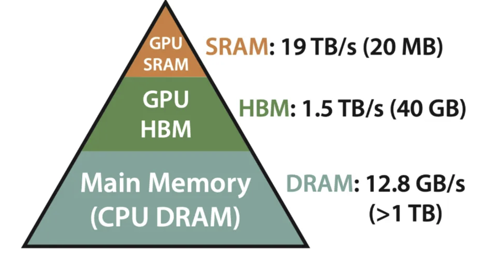

# Understanding GPUs

## Source

https://medium.com/ai-insights-cobet/understanding-gpu-architecture-basics-and-key-concepts-40412432812b

## Summary

### What is a GPU
-	GPUs can best be described as an inverse to CPUs
    - Instead of running complex tasks sequentially, GPUs run smaller tasks across thousands of cores simultaneously

- CPUs can have limited parallelism, but not nearly to the extent of GPUs

### Memory Heirarchy

- Split across 3 different sources:
    - SRAM
        - Very fast but small cache memory
        - Located inside GPU, uses Registers, L1 Cache, and L2 Cache
            - L1 Cache
                - First level cache inside Streaming Multiprocessor (SM)
                - Stores frequently accessed data to speed up calculations
            - L2 Chache
                - Larger, second level cache shared between multiple SMs
                - Helps store and reuse data too big for L1 cache
        - Caches reduce reliance on external memory (VRAM) and speed up calculations
        - Optimizing how data is stored speeds up GPU processing
        - Most important for getting the fundamentals of GPU processing working
    - HBM
        - Used in High Performance GPUs for AI and deep learning workloads
        - Stacks memory vertically
        - Overall, lowest priority for a GPU of the scale envisioned
    - DRAM
        - Main memory
        - Found on video card
        - Stores large amounts of data
        - Good to work on once main GPU is figured out
- Memory Transfer
    - Computationally expensive to transfer data from DRAM to SRAM
    - Optimizing efficient memory usage optimizes performance of tasks

