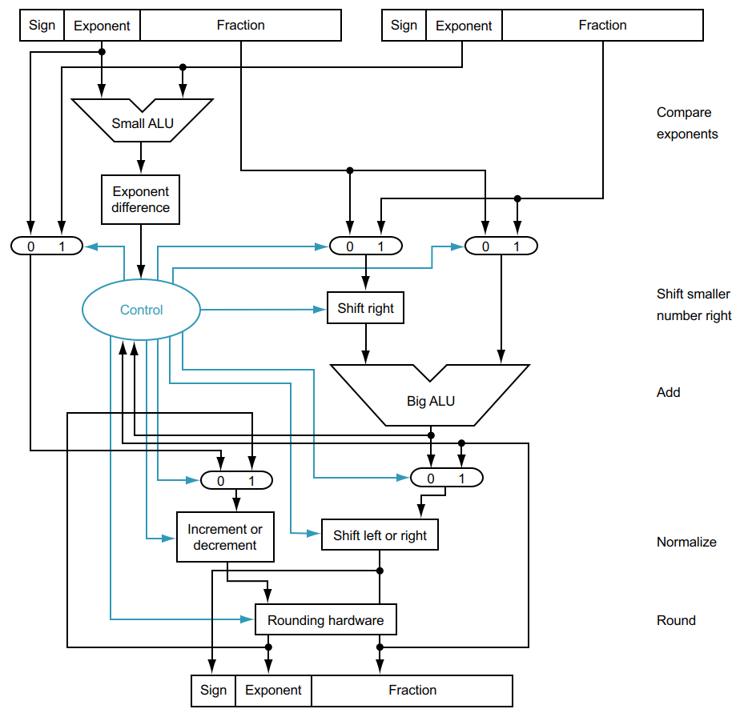

# Floating Point Adder

## Source

<https://cs.stackexchange.com/questions/164737/how-does-signed-floating-point-adder-implement>

## Explanation

Here is the basic design for a Floating Point Adder. I figured it would be more efficient to take a design that has already been tested than make my own from scratch. This takes from the design of a floating point value, and its difference from that of an int.

## Going forward

Looking at this, it seems like it would be very hard to get a FP adder on either an FPGA or ASIC, nontheless an FP ALU