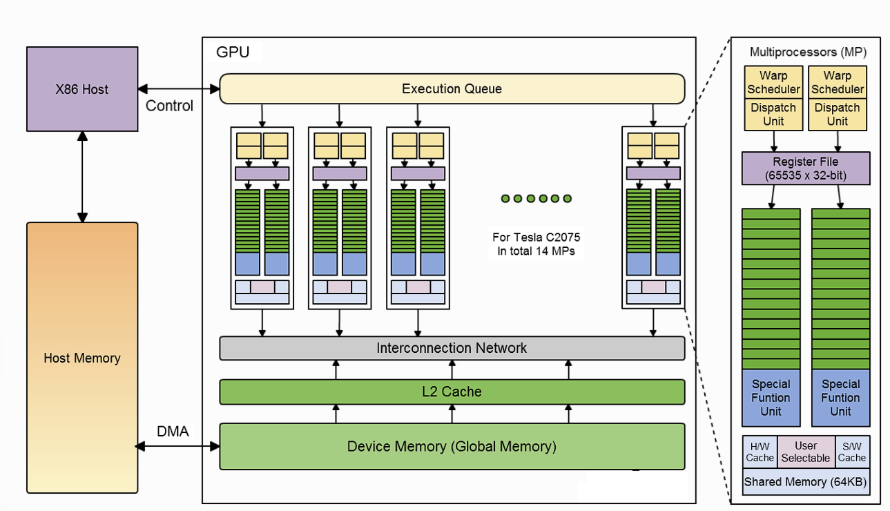
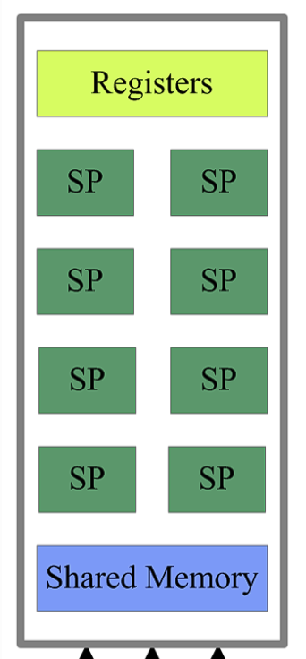

# Introduction to GPU Architecture

## Source

https://enccs.github.io/openmp-gpu/gpu-architecture/

## Summary

### Why Use GPUs
- Term GPU is sometimes used interchangebly with the term accelerator
- GPUs provide much higher instruction throughput and memory bandwidth than CPUs

### GPU Model

- Accelerators:
    - Seperate from main circuit board
    - Contain own processor, memory, power, etc.
    - Model:
        

- Basics:
    - GPUs are made up of multiple multiprocessors
        - Multiprocessor (Simplified)
            - Scalar Processor
            - Registers
            - Shared Memory
            
        - Multiprocessor Contents (Nvidia Design):
            - Single Precision Cores
                - Core that operates on 32 bit floating point
            - Double Precision Cores
                - Core that operates on 64 bit floating point
            - Integer Cores
                - Core that operates on 32 bit integers
            - Tensor Core
                - Core that performs matrix multiplication
            - Memory Block
                - Manages Shared Memory in L1
            - Registers
                - Allows for GPU to run threads

- Parallelism
    - A kernel runs a block of code on a GPU, running multiple threads in parallel
        - All threads execute the same instructions on different data
            - SIMD (Single Instruction Mutliple Data parallel programming model)
    - Hardware Software Interaction
        - Thread <-> Scalar Processor
        - Thread Block <-> Multiprocessor
        - Kernel <-> Device

- Memory Architecture
    - All variables reside in *Global Memory*
        - Accessible by all active threads
    - Each thread is allocated a set of registers
        - Cannot be accessed by registers not part of the set
        - Cost of accessing from registers is less than global memory