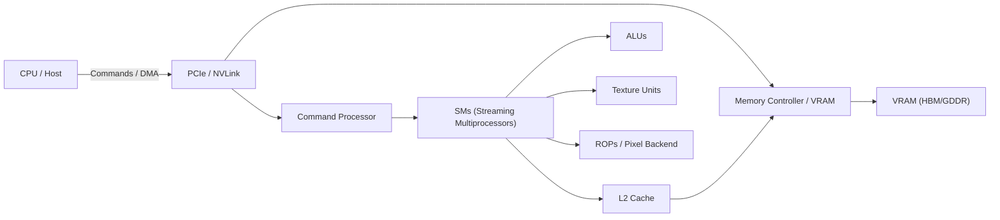
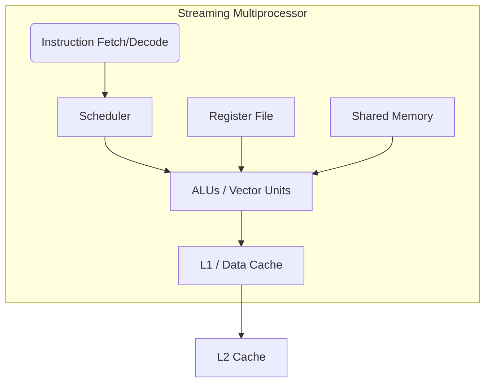

# GPU Architecture Overview

## Overview

This section provides a high-level overview of GPU architecture, focusing on the key components, their roles, and how they interact to execute graphics and compute workloads efficiently. It draws from multiple sources, including vendor documentation and academic resources, to provide a comprehensive understanding of modern GPU design. It is highly recommended to read through the linked sources for a deeper understanding of the underlying architecture and design principles.

## Brief overview of key GPU components

Below is a summary of the main components found in modern GPUs, along with their primary functions (note that some of these components may vary between vendors and architectures, and others may be outside of scope of this project):

- **Shader Core / Streaming Multiprocessor (SM):** A programmable compute block that executes many lightweight threads in parallel. It contains ALUs, local register files, and shared memory and runs shader or compute kernels.

- **Arithmetic Logic Units (ALUs):** Perform integer and floating-point arithmetic and logical operations; vectorized ALUs execute the bulk of shader and compute work.

- **Control Unit / Instruction Fetch & Decode:** Dispatches and sequences instructions to ALUs, handles program flow, and coordinates per-thread execution.

- **Warp / Wavefront:** A fixed-size group of threads that execute the same instruction in lockstep on different data lanes (e.g., 32 threads per warp on many GPUs).

- **Scheduler / Thread Dispatcher:** Issues warps/wavefronts to execution units, hides latency by switching between ready groups, and enforces dependencies and hazards.

- **Register File:** Fast per-thread storage for live values; each thread in a warp gets a subset of the register file for low-latency access.

- **Shared Memory / Scratchpad:** Low-latency, software-managed memory local to an SM used for inter-thread communication and data reuse.

- **L1 Cache / Data Cache:** Small, fast caches close to the SMs for frequently accessed data and to reduce traffic to higher-level caches or memory.

- **L2 Cache / Unified Cache:** A larger, shared cache that services multiple SMs and reduces DRAM bandwidth pressure.

- **Texture Mapping Units (TMUs):** Specialized units for texture sampling, filtering, and addressing used heavily in graphics and some compute workloads.

- **Rasterizer & Fixed-Function Units:** Handle geometric processing (vertex shading results -> fragments), triangle setup, rasterization, clipping, and related fixed-function stages in the graphics pipeline.

- **ROPs (Render Output Units) / Pixel Backend:** Perform blending, depth/stencil tests, and write final pixel/texel data to framebuffer or render targets.

- **Memory Controller & VRAM:** Interfaces to high-bandwidth graphics memory (GDDR/HBM), managing transfers, refresh, and scheduling of memory requests.

- **Command Processor / Driver Interface:** Receives work submissions from the CPU/driver, schedules context/state changes, and programs GPU work queues.

- **Interconnect / Host Interface (PCIe/NVLink):** Connects the GPU to the host CPU and other devices, carrying commands, data, and synchronization traffic.

- **DMA Engines & Copy Engines:** Offload bulk transfers between host and device memory or between device memory regions without involving the SMs.

Each component above plays a distinct role in balancing compute throughput, memory bandwidth, and latency to execute graphics and general-purpose workloads efficiently.

## Diagrams

### High-level GPU block diagram

### Streaming Multiprocessor (SM) internal view

